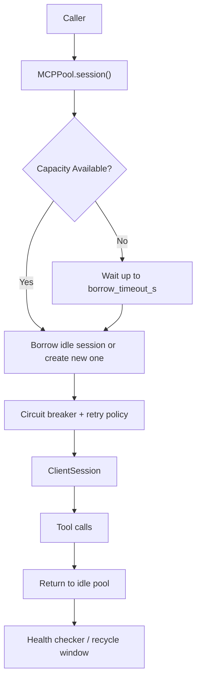

# Architecture

`mcpool` has three core responsibilities:

- manage warm session capacity
- keep idle sessions healthy and fresh
- protect upstream MCP endpoints from retry storms

## Runtime Flow

## `list_tools()` Path

`list_tools()` uses a single-flight refresh path:

1. Check the TTL cache.
2. If valid, return immediately.
3. If stale, one caller refreshes while other callers wait for the result.
4. Store the fresh tool list and update cache metrics.

## Shutdown Model

Shutdown marks the pool as draining, waits for in-flight borrows to complete up to `drain_timeout_s`, then closes all sessions and clears the pool state.
